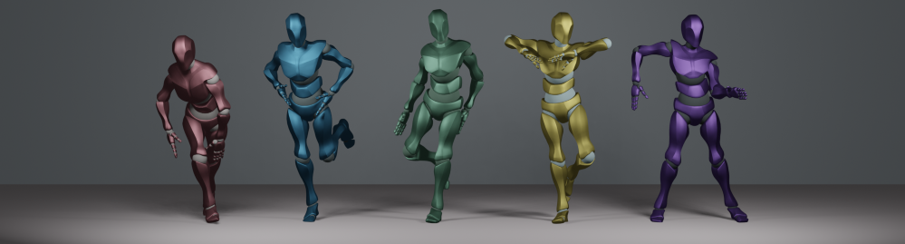

## EDGE &mdash; Official PyTorch implementation
**EDGE: Editable Dance Generation From Music** (CVPR 2023)<br>
Jonathan Tseng, Rodrigo Castellon, C. Karen Liu<br>
https://arxiv.org/abs/2211.10658
*Abstract: Dance is an important human art form, but creating new dances can be difficult and time-consuming. In this work, we introduce Editable Dance GEneration (EDGE), a state-of-the-art method for editable dance generation that is capable of creating realistic, physically-plausible dances while remaining faithful to the input music. EDGE uses a transformer-based diffusion model paired with Jukebox, a strong music feature extractor, and confers powerful editing capabilities well-suited to dance, including joint-wise conditioning, and in-betweening. We introduce a new metric for physical plausibility, and evaluate dance quality generated by our method extensively through (1) multiple quantitative metrics on physical plausibility, beat alignment, and diversity benchmarks, and more importantly, (2) a large-scale user study, demonstrating a significant improvement over previous state-of-the-art methods.*
## Requirements
* We recommend Linux for performance and compatibility reasons. Windows will probably work, but is not officially supported.
* 64-bit Python 3.7+
* PyTorch 1.12.1
* At least 16 GB RAM per GPU
* 1&ndash;8 high-end NVIDIA GPUs with at least 16 GB of GPU memory, NVIDIA drivers, CUDA 11.6 toolkit.

The example build this repo was validated on:
* Debian 10
* 64-bit Python 3.7.12
* PyTorch 1.12.1
* 16 GB RAM
* 1 x NVIDIA T4, CUDA 11.6 toolkit

This repository additionally depends on the following libraries, which may require special installation procedures:
* [jukemirlib](https://github.com/rodrigo-castellon/jukemirlib)
* [pytorch3d](https://github.com/facebookresearch/pytorch3d)
* [accelerate](https://huggingface.co/docs/accelerate/v0.16.0/en/index)
	* Note: after installation, don't forget to run `accelerate config` . We use fp16.
* [wine](https://www.winehq.org) (Optional, for import to Blender only)
## Getting started
### Quickstart
* Download the saved model checkpoint from [Google Drive](https://drive.google.com/file/d/1BAR712cVEqB8GR37fcEihRV_xOC-fZrZ/view?usp=share_link) or by running `bash download_model.sh`.
* Run `demo.ipynb`, which demonstrates the basic interface of the model
### Load custom music
You can test the model on custom music by downloading them as `.wav` files into a directory, e.g. `custom_music/` and running
```.bash
python test.py --music_dir custom_music/
```
This process may take a while, since the script will extract all the Jukebox representations for the specified music in memory. The representations can also be saved and reused to improve speed with the `--cache_features` and `--use_cached_features` arguments. See `args.py` for more detail.
Note: make sure file names are regularized, e.g. `Britney Spears - Toxic (Official HD Video).wav` may cause unpredictable behavior due to the spaces and parentheses, but `toxic.wav` will behave as expected. See how the demo notebook achieves this using the `youtube-dl --output` flag.

### (Optional, retraining only) Dataset Download
Download and process the AIST++ dataset (wavs and motion only) using:
```.bash
cd data
bash download_dataset.sh
python create_dataset.py --extract-baseline --extract-jukebox
```
This will process the dataset to match the settings used in the paper. The data processing will take ~24 hrs and ~50 GB to precompute all the Jukebox features for the dataset.
### Train your own model
Once the AIST++ dataset is downloaded and processed, run the training script, e.g.
```.bash
accelerate launch train.py --batch_size 128  --epochs 2000 --feature_type jukebox --learning_rate 0.0002
```
to train the model with the settings from the paper. The training will log progress to `wandb` and intermittently produce sample outputs to visualize learning. Depending on the available GPUs, this can take ~6 - 24 hrs.
### Evaluate your model
Evaluate your model's outputs with the Physical Foot Contact (PFC) score proposed in the paper:
1. Generate ~1k samples, saving the joint positions with the `--save_motions` argument
2. Run the evaluation script
```.bash
python test.py --music_dir custom_music/ --save_motions
python eval/eval_pfc.py
```
## Blender 3D rendering
In order to render generated dances in 3D, we convert them into FBX files to be used in Blender. We provide a sample rig, `SMPL-to-FBX/ybot.fbx`.
After generating dances with the `--save-motions` flag enabled, move the relevant saved `.pkl` files to a folder, e.g. `smpl_samples`
Run
```.bash
python SMPL-to-FBX/Convert.py --input_dir SMPL-to-FBX/smpl_samples/ --output_dir SMPL-to-FBX/fbx_out
```
to convert motions into FBX files, which can be imported into Blender and retargeted onto different rigs, i.e. from [Mixamo](https://www.mixamo.com). A variety of retargeting tools are available, such as the [Rokoko plugin for Blender](https://www.rokoko.com/integrations/blender).

## Development
This is a research implementation and, in general, will not be regularly updated or maintained long after release.
## Citation
```
@article{tseng2022edge,
  title={EDGE: Editable Dance Generation From Music},
  author={Tseng, Jonathan and Castellon, Rodrigo and Liu, C Karen},
  journal={arXiv preprint arXiv:2211.10658},
  year={2022}
}
```
## Acknowledgements
We would like to thank [lucidrains](https://github.com/lucidrains) for the [Adan](https://github.com/lucidrains/Adan-pytorch) and [diffusion](https://github.com/lucidrains/denoising-diffusion-pytorch) repos, [softcat477](https://github.com/softcat477) for their [SMPL to FBX](https://github.com/softcat477/SMPL-to-FBX) library, and [BobbyAnguelov](https://github.com/BobbyAnguelov) for their [FBX Converter tool](https://github.com/BobbyAnguelov/FbxFormatConverter).